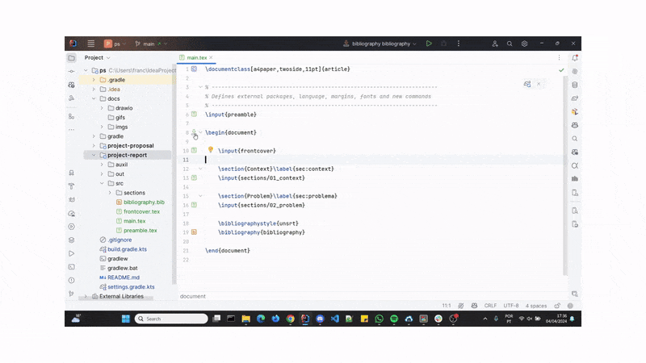

# Project Documentation

**Unofficial** template for students in the BSc
in [Computer Science and Engineering](https://www.isel.pt/en/curso/bsc-degree/computer-science-and-computer-engineering)
undergraduate program at [ISEL](https://www.isel.pt/en),
designed for use in the [Project and Seminar](https://www.isel.pt/en/leic/project-and-seminar) course documentation.

> [!IMPORTANT]
> Consult the official course page for the most up-to-date information, do not rely solely on this template

## Table of Contents

- [Features](#features)
- [Goal](#goal)
- [Structure](#structure)
- [Instructions](#instructions)
    - [Configure LaTeX environment in Intellij IDEA](#configure-latex-environment-in-intellij-idea)
    - [Add a new subproject](#add-a-new-subproject)
    - [Compile and build all subprojects](#compile-and-build-all-subprojects)
        - [Manually](#manually)
        - [Automatically](#automatically)

## Features

- ✅ **Three LaTeX templates for required project documents:**
    - [Project Proposal](project-proposal/out/main.pdf): Initial document outlining the project objectives and plan.
    - [Project Report](project-report/out/main.pdf): Final comprehensive report on the project's outcomes and findings.
    - [Project Organization](project-org/out/main.pdf): Details the structure and management plan of the project.
- ✅ **Automatic compilation and build:** Ensures the most up-to-date version of the documents is always available
  without manual intervention.
- ✅ **Basic examples of LaTeX usage:** Includes tables, figures, references, equations, and other common LaTeX elements.
- ✅ **Organized structure:** Includes separate directories for LaTeX source files, generated PDFs, auxiliary files, and
  figures. This modular organization allows multiple team members to work on different sections or chapters
  simultaneously, minimizing potential conflicts and streamlining collaboration.
- ✅ **Easy to add new documents:** Features a simple configuration process for integrating additional components.
- ✅ **Customizable LaTeX environment:** Allows for the use of different configurations to tailor the setup to your
  needs.

## Goal

As the template provides a ready-to-use LaTeX environment with a pre-designed layout and automatic compilation process,
it allows you and your team to focus _only_ on the content of the project documentation.

> [!NOTE]
> This template provides a structure for managing and compiling LaTeX documents locally, but with the need to install
> necessary software.
> Alternatively, you can use [Overleaf](https://www.overleaf.com/) or any other online LaTeX editor,
> which allows you to work without installing any additional software.
> For that, place the LaTeX files in the online editor and compile them there.

## Structure

Each subproject has the following structure, assuming no changes are made to the default configuration:

- `src/`: Contains the LaTeX source files:
    - `main.tex`: Main LaTeX file where the document is structured only;
    - `bibliography.bib`: Bibliography file where the references are stored;
    - `sections/` or `chapters/`: Contains the sections or chapters of the document, depending on its size. This is
      where the content is written; usually, each section or chapter is a separate file, numbered in the order they
      appear in the document;
    - `preamble.tex`: Defines external packages, language, margins, fonts and new or redefined commands;
- `out/`: Contains the generated pdf file.
- `auxil/`: Contains the auxiliary files generated during the compilation process.
- `figures/`: Contains the figures used in the LaTeX source files.

With this structure, each team member can work on a different section or chapter of a document, minimizing potential
conflicts. Unlike most templates that have everything in a single file, making simultaneous collaboration difficult,
this template's modular design facilitates concurrent work on the same document.

## Instructions

### Configure LaTeX environment in Intellij IDEA

1. Install [MikTeX](https://miktex.org/download);
    - Update `MikTeX` packages: `MikTeX Console -> Updates -> Check for updates`;
2. Install [SumatraPDF](https://www.sumatrapdfreader.org/download-free-pdf-viewer) viewer or any other pdf viewer of
   your
   choice;
3. Install [TeXiFy IDEA](https://plugins.jetbrains.com/plugin/9473-texify-idea) plugin;
4. Configure inverse-search in `Intellij IDEA` for the chosen pdf viewer: `Tools -> LaTeX -> Configure Inverse Search`.
   Inverse-search enables the user to jump from the pdf to the corresponding tex file source.

### Add a new subproject

1. Create in root folder a new folder with the name of the subproject;
2. Go to [settings.gradle.kts](settings.gradle.kts) and add the new subproject with:
    ```kotlin
    include(":subproject-name")
    ```
3. Compile and build pdf,
   resolving any bibliographic references,
   with the Gradle task `buildPdf` using the Gradle Panel (usually located on the right side of the IDE)
   or the following command in the terminal in the root directory:
    ```bash
    ./gradlew :subproject-name:buildPdf
    ```

4. **[Optional]** Configure alternative names for the subproject directories and the main tex file in
   the `build.gradle.kts` file:
    - Create a `build.gradle.kts` file in the subproject directory;
    - Add the following code:

       ```kotlin
       ext.set("variable", "value")
       ```
      | Variable          | Default value | Description                                                                     |
                                    |-------------------|---------------|---------------------------------------------------------------------------------|
      | `srcDirName`      | `src`         | name of the tex source file's directory                                         |
      | `outDirName`      | `out`         | name of the output directory, where the pdf file will be generated to           |
      | `auxDirName`      | `auxil`       | name of the auxiliary directory, where the auxiliary files will be generated to |
      | `mainTexFileName` | `main`        | name of the main tex file                                                       |
      | `useBibtex`       | `true`        | use bibtex to resolve bibliography references                                   |

5. **[Optional]** If no changes are made to the bibliography references in development, it is possible to speed up the
   compilation process
   by using IDEA's run configuration in the `<main>.tex` file instead of the Gradle task `buildPdf`.
   This is because the latter has
   more [compiler iterations](https://www.overleaf.com/learn/latex/Bibliography_management_with_bibtex#Enter_\(\mathrm{Bib\TeX}\))
   to resolve the bibliography references.
    - In the run configuration panel, edit the paths to the corresponding subproject directories:

   |  |
         |:---------------------------------------------------------------:|
   |                    *Edit Run Configuration*                     |

    - To compile the document use the shortcut `Shift + F10` or the gutter icon `Run`.

> [!IMPORTANT]
> It is advised to not delete the generated auxiliary files as they can be used in subsequent compilations to speed up
> the process.

### Compile and build all subprojects

#### Manually

To compile and build all pdfs in all subprojects, use the Gradle task `buildAllPdfs` which can be found in the Gradle
Panel or by running the following command in the terminal:

```bash
./gradlew buildAllPdfs
```

#### Automatically

A [workflow](.github/workflows/compile-and-deploy-all-documents.yaml) using GitHub Actions
is set up to automatically compile
and build all pdfs in all subprojects when a `push` is made to the repository in the default branch
(usually `main` or `master`) or when a `pull request` is opened to the default branch.
Can be further customized to run on other branches, tags and/or other events, even on chron schedules.
Learn
more [here](https://docs.github.com/en/actions/writing-workflows/choosing-when-your-workflow-runs/events-that-trigger-workflows).
